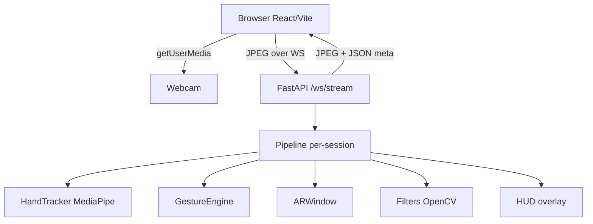
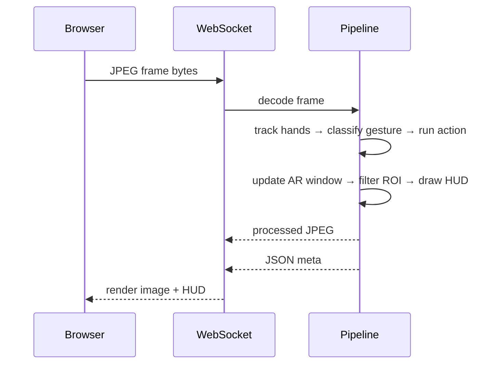
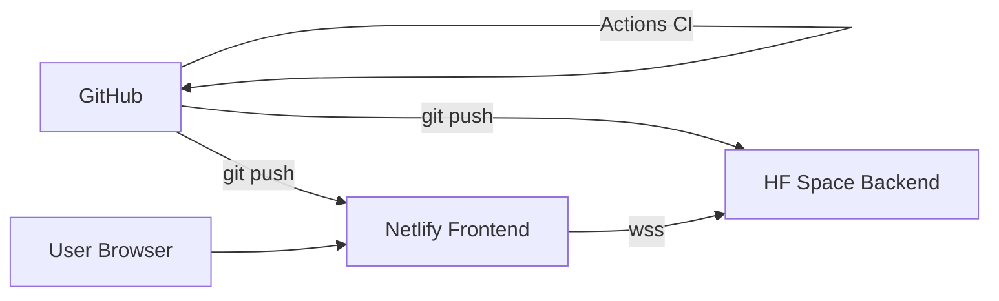
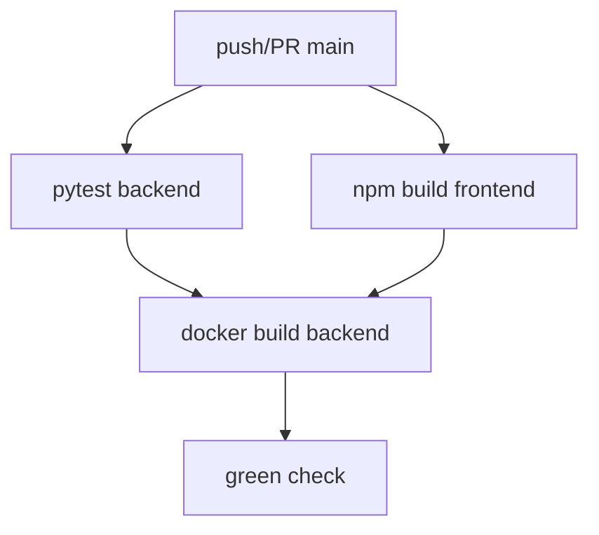

# System Design Diagrams

## Component

```mermaid
graph TD
  B[Browser React/Vite] -->|getUserMedia| CAM[Webcam]
  B -->|JPEG over WS| API[FastAPI /ws/stream]
  API --> PIPE[Pipeline per-session]
  PIPE --> HT[HandTracker MediaPipe]
  PIPE --> GE[GestureEngine]
  PIPE --> AW[ARWindow]
  PIPE --> FL[Filters OpenCV]
  PIPE --> HUD[HUD overlay]
  API -->|JPEG + JSON meta| B
```

## Sequence (per frame)

```mermaid
sequenceDiagram
  participant U as Browser
  participant W as WebSocket
  participant P as Pipeline
  U->>W: JPEG frame bytes
  W->>P: decode frame
  P->>P: track hands → classify gesture → run action
  P->>P: update AR window → filter ROI → draw HUD
  P-->>W: processed JPEG
  P-->>W: JSON meta
  W-->>U: render image + HUD
```

## Deployment

```mermaid
graph LR
  GH[GitHub] -->|Actions CI| GH
  GH -->|git push| NET[Netlify Frontend]
  GH -->|git push| HF[HF Space Backend]
  USER[User Browser] --> NET
  NET -->|wss| HF
```

## CI/CD

```mermaid
graph TD
  PUSH[push/PR main] --> T1[pytest backend]
  PUSH --> T2[npm build frontend]
  T1 --> T3[docker build backend]
  T2 --> T3
  T3 --> DONE[green check]
```
